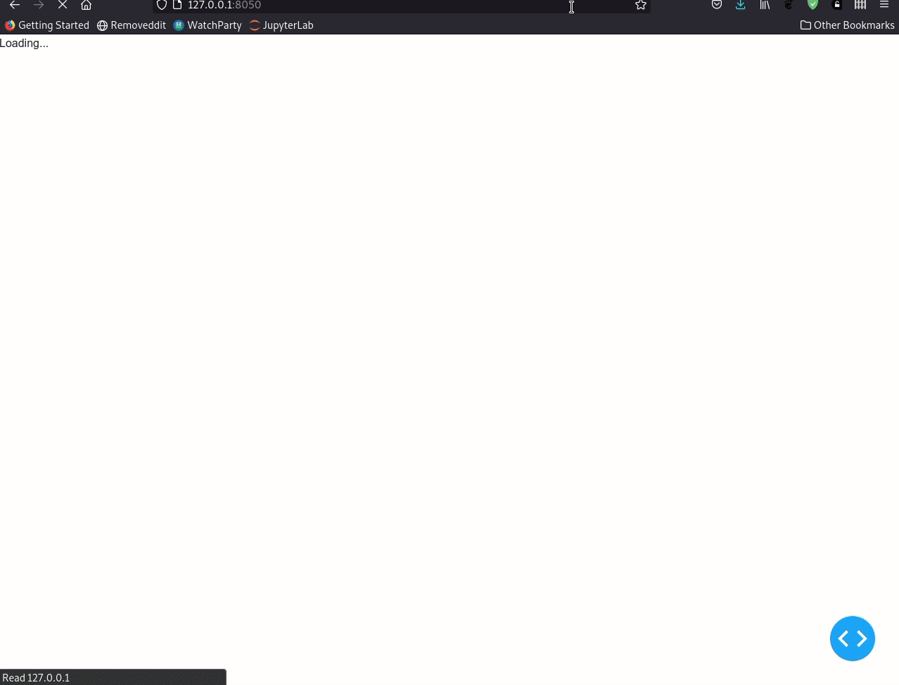
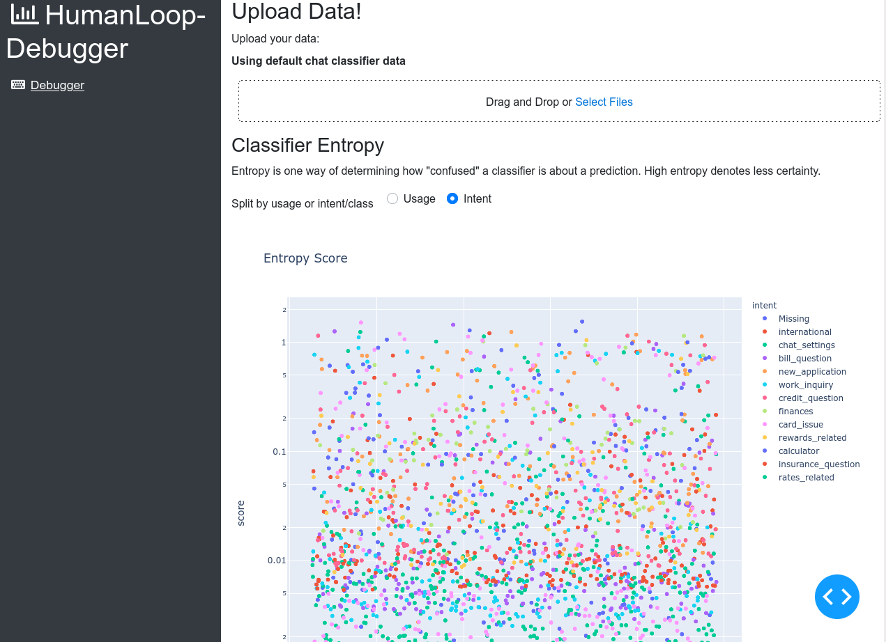
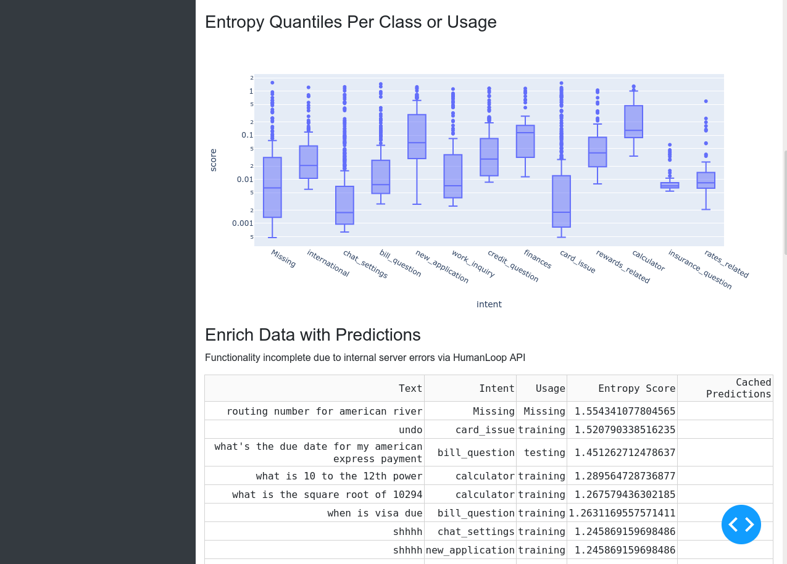

# HumanLoop-Debugger

A web-app based debugger for HumanLoop

## Discussion

I would be hard-pressed to call this a debugger tool. It ended up being more of a visualisation dashboard. Partly because of the time spent on finangling Plotly's Dash to work as I wanted it to. 

I think if time permitted and the prediction API was working there might have been some interesting stuff that could have been done, as well some low hanging fruit like classification confusion matrices etc. 

I also believe the language model used is BERT based, so something like t-SNE clustering on the sentence embeddings from the BERT model might have made for one very interesting visualisation. (Allowing one to identify clusters of data points where classification intent was different but the latent representations were strongly overlapped or have high cosine similarity). A quick google tells me there is a way of computing fixed length sentence embeddings from BERT (and adjacent) models. [Link](https://arxiv.org/pdf/1908.10084.pdf)

**N.b. this web app is based off a Plotly Dash and the CookieCutter template SlapDash. The following instructions are taken almost verbatim from CC SlapDash and should allow you to install and use the web app relatively easily.**

### Installation

After cloning/downloading the repository, simply install HumanLoop-Debugger as a package into your target virtual environment:

    $ pip install PATH_TO_humanloop_debugger

During development you will likely want to perform an editable install so that
changes to the source code take immediate effect on the installed package.

    $ pip install -e PATH_TO_humanloop_debugger

### Running Your App

This project comes with two convenience scripts for running your project in
development and production environments, or you can use your own WSGI server to
run the app.

### Run Dev App 

Installing this package into your virtualenv will result into the development
executable being installed into your path when the virtualenv is activated. This
command invokes your Dash app's `run_server` method, which in turn uses the
Flask development server to run your app. The command is invoked as follows

    $ run-humanloop_debugger-dev

The script takes a couple of arguments optional parameters, which you can
discover with the `--help` flag. You may need to set the port using the `--port`
parameter. If you need to expose your app outside your local machine, you will
want to set `--host 0.0.0.0`.

### Run Prod App

While convenient, the development webserver should *not* be used in
production. Installing this package will also result in a production executable
being installed in your virtualenv. This is a wrapper around the
`mod_wsgi-express` command, which streamlines use of the [mod_wsgi Apache
module](https://pypi.org/project/mod_wsgi/) to run your your app. In addition to
installing the `mod_wsgi` Python package, you will need to have installed
Apache. See installation instructions in the [mod_wsgi
documentation](https://pypi.org/project/mod_wsgi/). This script also takes a
range of command line arguments, which can be discovered with the `--help` flag.

    $ run-humanloop_debugger-prod
    
This script will also apply settings found in the module `humanloop_debugger.prod_settings` (or a custom Python file supplied
with the `--settings` flag) and which takes precedence over the same settings
found in `humanloop_debugger.settings`.

### Screenshots

